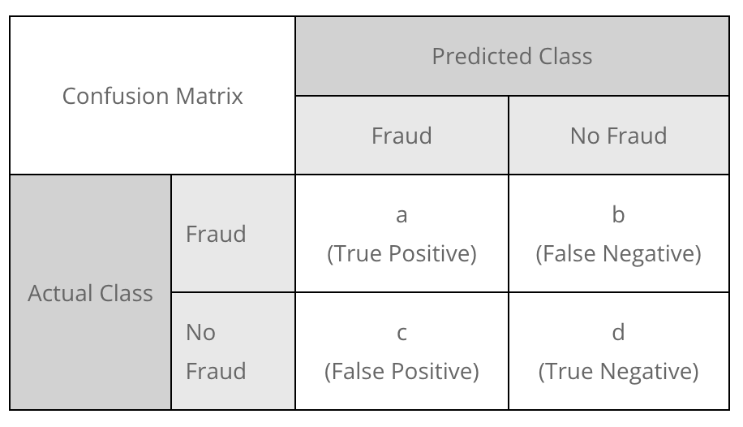
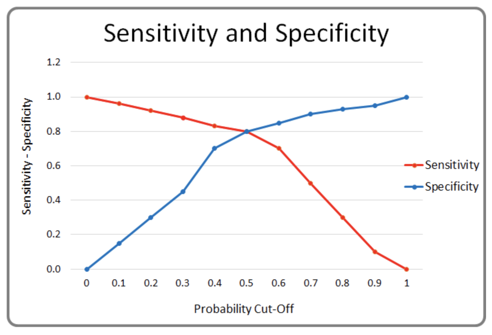
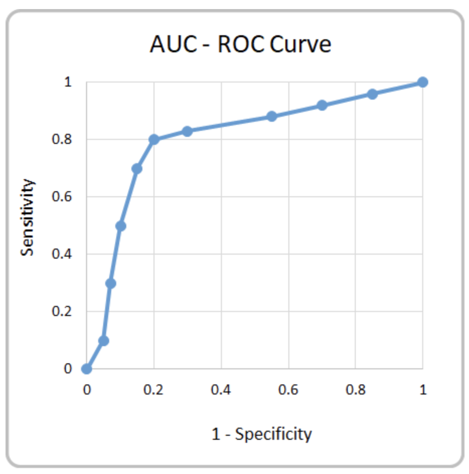
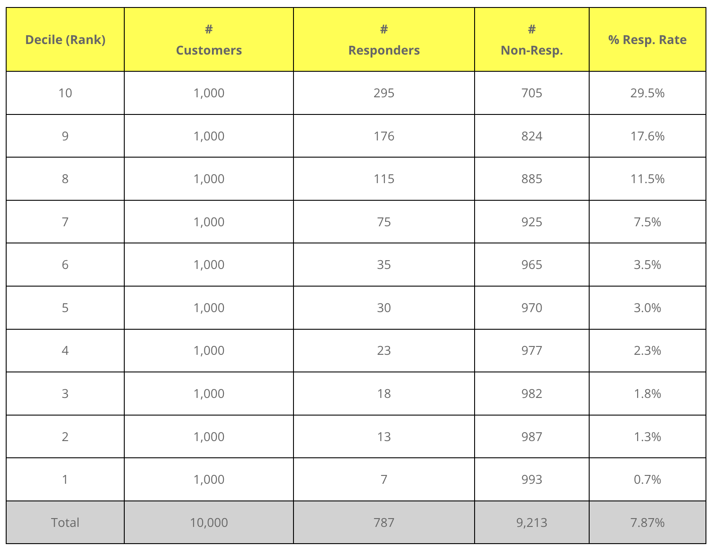
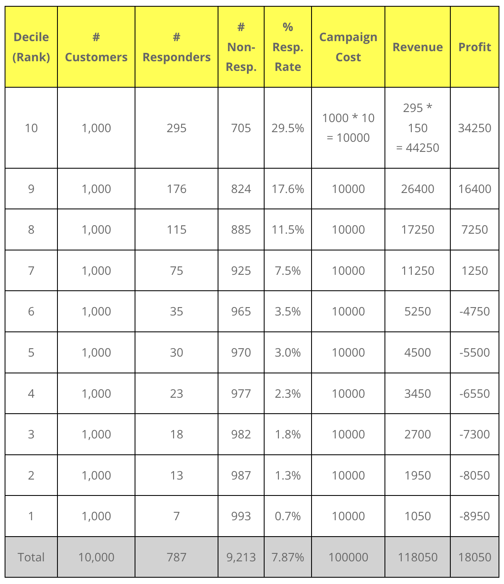
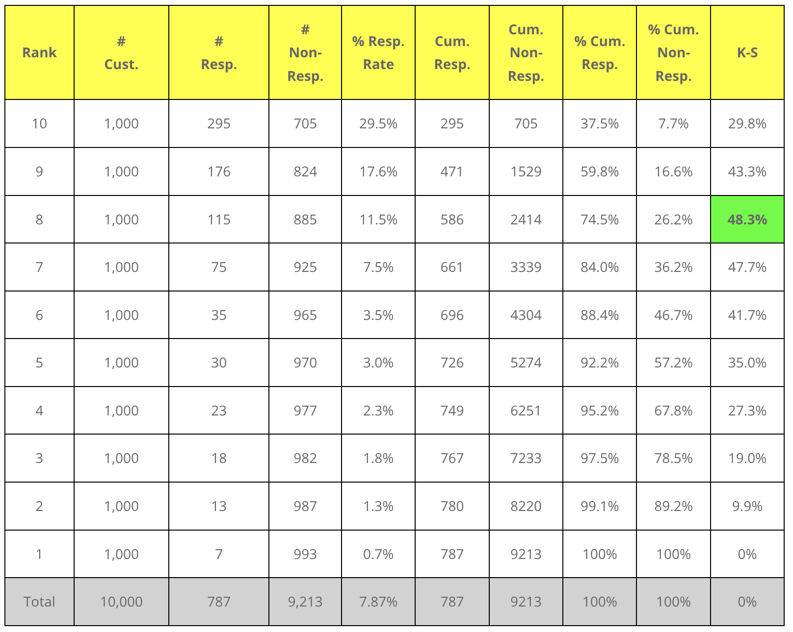
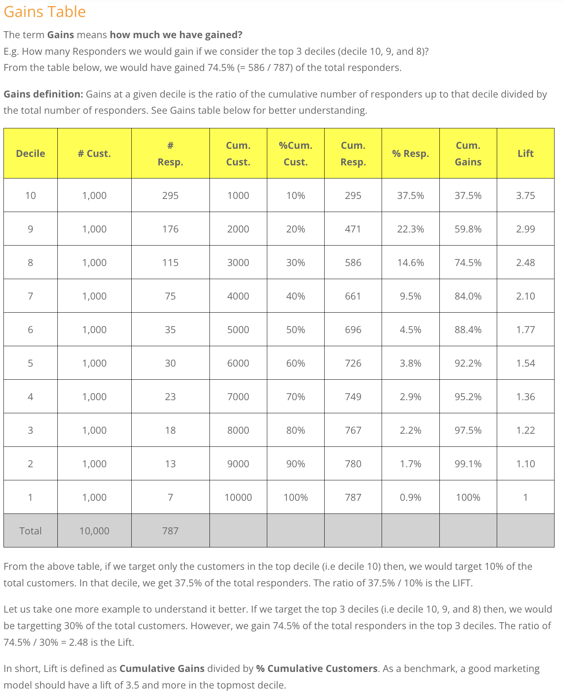
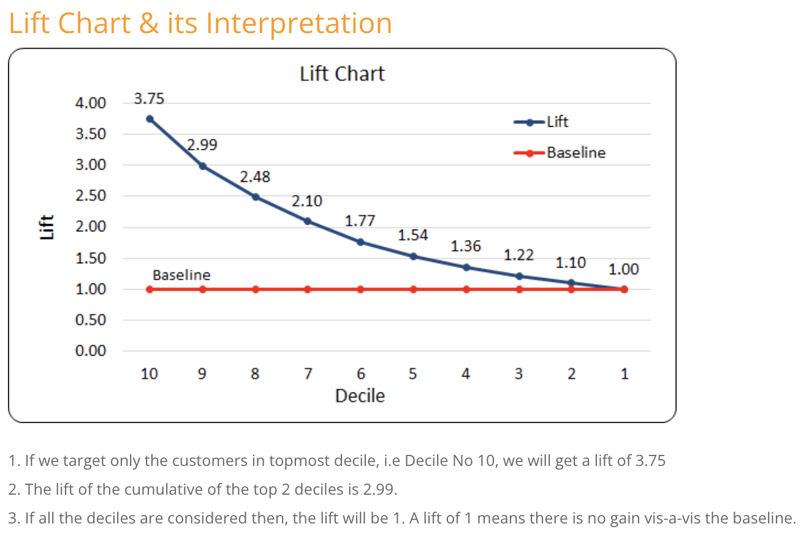

# Classification Metrices 

Various Metrices used  for classification problems.

## **[`Confusion Matrix`](https://www.k2analytics.co.in/classification-accuracy-auc-roc-curve/)**  

> **True/False** tells the truth of the prediction.  
> **Positive/Negative** tells the output of the model.

  

- **`Positive`**: The phenomenon of our interest is called Positive.  
   E.g. – In a Fraud Detection Model, we are interested in predicting fraud. The phenomenon of our interest is Fraud, as such, we will use the term Positive for actual fraudulent cases and Negative otherwise.

- **`True Positive`**: `Actual` `positives` `correctly` `predicted` `as` `positive`.

- **`False Positive`**: `Actual` `Negative`, `but` `predicted` `as` `positive`.  

   > Total Positive (in Prediction) = True Positive + True Negative  
   > Total Negative (in Prediction) = False Positive + False Negative

### **`Accuracy`**
It is the ratio of correct predictions to total number of predictions.  

$$
\text{Accuracy}=\frac{\text{True Positive}+\text{True Negative}}{\text{Total Observation}}
$$

### **`Precision`**

Precision is an important metrics used to evaluate the performance of classification models, especially in scenarios where the classes are **imbalanced**.
- Precision measures the **accuracy of total positive predictions**. 
- It is the ratio of true positive predictions to the total number of positive predictions made by the classifier.
- E.g., Out of all the ones which model has predicted as **`1`** how many actually are **`1`**. 
- It is a measure of the correctness of positive.
- It is defined as the ratio of correctly predicted positive observations to the total predicted positives.

$$
\text{Precision} = \frac{\text{True Positve}}{\text{True Positve + False Positve}}
$$
  
### **`Recall/Sensitivity (True Positive Rate)`**
Recall is an important metrics used to evaluate the performance of classification models, especially in scenarios where the **`classes are imbalanced`**.
- **`Recall`**, also known as **`sensitivity`** or **`true positive rate`**. 
- It is the ratio of true positive predictions to the total number of actual positive instances in the dataset.
- E.g., Out of all the **`1`** in the entire dataset how many our model has predicted as **`1`**.

**`Note`**: It's important to note that **`precision`** and **`recall`** are often inversely related; improving one may lead to a decrease in the other. Therefore, finding the right balance between precision and recall is crucial depending on the specific requirements of the task at hand.

$$
\text{Sensitivity = Recall} =  \frac{\text{True Positive}}{\text{True Positive + False Negative}}
$$

### **`Specificity (True Negative Rate)`**
The proportion of actual negatives that are correctly identified.  
`Recall for Negative Class`
$$
\text{Specificity} = \frac{\text{True Negative}}{\text{True Negative + False Positive}}
$$

## **`F1 Score`**  
- The F1 score is particularly useful in situations where you want to balance the trade-off between **`precision`** and **`recall`**. Here are some scenarios where you might consider using the F1 score.  
- F1 score, is the harmonic mean of precision and recall. It provides a single metric that balances both precision and recall.
$$
F1 = 2 \times \frac{precision * recall}{precision + recall}
$$

## **`AUC-ROC Curve`**  
**Full Form**: AUC-ROC Curve stands for Area Under Curve – Receiver Operating Characteristics Curve.  
- The ROC curve is a **visual representation** that showcases how well a **binary classifier** system can **diagnose**, or **discriminate** between, different classes **when the threshold for classification is changed**.
- The discrimination threshold in the ROC curve definition refers to **probability**, the output of a binary classifier model.
- This score can be used when we have imbalanced classes.  
- It represents the degree or measure of separability of predictive models.

Steps to plot the ROC Curve are:  
1. Decide a threshold cut-off.
2. Classify the outcome to be POSITIVE or NEGATIVE. If the predicted probability is above the threshold cut-off then POSITIVE else NEGATIVE.
3. Calculate **Sensitivity** (**Recall**-True Positive Rate) and **Specificity** (**RecallOfNegatives**- True Negative Rate)
4. Repeat the steps 1 to 3 at least 15 to 20 times by varying the threshold between 0 to 1.
5. Plot the graph of Sensitivity vs (1 – Specificity). Sensitivity be on Y-axis and (1 – Specificity) on X-axis. This plot is ROC Curve.
   
Let us say, we consider the threshold cut-off to be 0. If the predicted probability is greater than or equal to 0 then Positive else Negative. In this case, all observations will be classified as Positive. The Sensitivity (Recall) of the binary classifier model will be 1 and Specificity will be 0.

On the other extreme, if we consider the threshold cut-off to be 1. If the predicted probability is greater than 1 then Positive else Negative. Probability cannot be more than 1, as such, all the observations will be classified as Negative. The Specificity (True Negative Rate) of the model will be 1 and Sensitivity (True Positive Rate) will be 0.

Sensitivity and Specificity varies between 0 to 1 depending on the cut-off. 

See the chart below. Chart Name:  
   1. ROC (Receiver Operating Characteristics)
   2. Sensitivity v/s Specificity
   3. Positive Recall v/s Negative Recall  

- **`Receiver Operating Characteristics (ROC)`** curve is a plot between Sensitivity (TPR) on the Y-axis and (1 – Specificity) on the X-axis. Shown below is the ROC Curve. The total area of the square in the plot = 1 * 1 = 1.
  
- **`Area Under Curve (AUC)`** is the proportion of area below the ROC Curve (blue curve in the graph shown below).

**`AUC Interpretation`**
The value of AUC ranges from 0 to 1. The table below explains the interpretation of AUC value.
| AUC Value Range | Interpretation  |
|-----------------|-----------------|
| >= 0.9          | Excellent Model |
| 0.8 to 0.9      | Good Model      |
| 0.7 to 0.8      | Fair Model      |
| 0.6 to 0.7      | Poor Model      |
| < 0.6           | Very Poor Model |

##### [**`Rank Order Table and Kolmogrov Smirnov(K-S) Table, Gains Table and Lift Chart`**](https://www.k2analytics.co.in/7-important-model-performance-measures/)

## **`Rank Order Table`**  
Rank Order Table is a key model performance measure used to evaluate how well the model separates the binary classes, viz, Responder class from Non-Responders, Defaulters from Non-Defaulters, Churners from Non-Churners, etc.  
1. **Predict Probability**: Apply the predictive model on the labeled data. Predict the probability of each record using the model.  
2. **Rank (Decile) the data**  
- Sort the data by Probability (Let us assume we have done ascending sort).
- Split the data in n equal parts (suppose 10), rank them as 1 to 10.
- Rank 1 be assigned to the group with the lowest probability and Rank 10 to the group with the highest probability.  
3. **Aggregate the data**: Aggregate the data by Rank and get the count of customers, count responders and count non-responders.
4. **Compute Response Rate**: Response rate is computed by taking the ratio of #(Responders) to #(Customers in each Decile)
5. **Interpreation of Rank Order table** 
   
     

   1. The above table s called the **Rank Order Table**.
   2. On an averagee the responder rate is 7.87%.
   3. In rank/decile 1 the responder rate is highest at 29.5%.
   4. In rank/decile 10 the responder rate is lowest at 0.7%.
   5. We can infer the threshold/cutoff point for our usecase.
   6. We can also infer if the model is performing well or not.
   7. Rank order tables are used for disigning the model implementation starategy, profit analysis, market research, decision marketing, trend analysis, etc.  

   **`NOTE`:** At times, minor cracks or breaks in the rank order may be acceptable. However, if there are any major whipsaws then, it is advisable to rebuild/recalibrate the model.

6. **Importance of Rank Order Table**  
The Rank Order table is very important because the implementation strategy of most of the models is designed based on it. Assume the average campaign cost per customer is Rs. 10/- and the revenue per conversion is Rs. 150/-. The campaign will be profitable only if our campaign conversion is above 6.7% (=10/150). The decile wise profitability for the above Rank Order table is as shown below:

   

> From the above table, it is clear that overall profitability is just Rs. 18050. However, if we target the deciles 10 to 7 then the profitability is Rs. 59150/-. By targeting just 40% of the overall base we get 3.3X times higher profitability.

## **`Kolmogorov Smirnov (K-S)`** 
- **The point of maximum separation is the K-S statistics.**
- Wherever the value of KS is max, that valus is KS-statistics.
- K-S Statistics measures how well the binary classifier model separates the two classes.
- It's range is between 0 and 1.
- Higher the value better the model in separating the two classes.  

- **Interpretation of K-S statistic**
  - The maximum separation between the Responder and Non-Responder class is 48.3%. So the K-S statistics is 0.483.
  - The range of K-S value is from 0 to 1. 
  - It is desirable to have a K-S statistic between **`0.45 to 0.70`** for a good model, especially marketing models.
  - If the **K-S value is below 0.45** then, the model may have weak to moderate separation power.
  - If the **K-S value exceeds 0.7** then, there is a risk of **overfitting** and one should be cautious. It is advisable to do a stringent quality check of calculations, assumptions, hypothesis, data, etc before accepting the model having K-S of 0.7 or more.
  
## **`Gains Table & Lift Chart`**  
- Gains table and Lift chart are used to measure how much gain/lift we can expect by using a predictive model vis-a-vis not using the model. 
- Lift is calculated by taking a ratio of model strategy success rate to a random strategy success rate.
- **Lift Calculation**
   > Total number of customers = 10000  
   > Total number of Responders = 787  
   > Response Rate = 787 / 10000 = 7.87%  
   .  
   > Random strategy: Assume you randomly select a sample of 1000 customers for a marketing campaign. How many responders would you expect? >>> Approx 78 or 79 responders.  
   .  
   > Model-based strategy: You target 1000 customers from the topmost decile, i.e Decile 10. How many responders would you expect? >>> Approx 295 responders.  
   .  
   > What will be the lift? The lift will be 3.75 (Lift = 295 / 78).  
   .

> **`Lift Definition: Lift is defined as the ratio of the success rate you get by the model strategy to the random strategy.`**

 

 

## **`Concordance`**  
[TBD](https://www.k2analytics.co.in/concordance-gini-and-goodness-of-fit/)
## **`Gini`**  
[TBD](https://www.k2analytics.co.in/concordance-gini-and-goodness-of-fit/)
## **`Goodness of Fit`**  
[TBD](https://www.k2analytics.co.in/concordance-gini-and-goodness-of-fit/)

