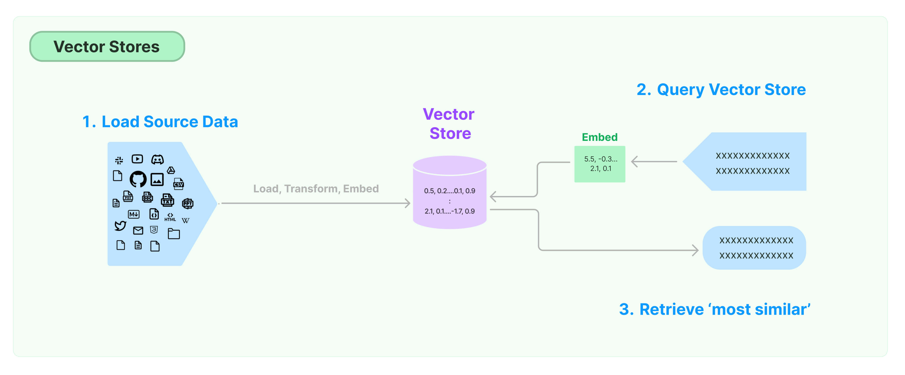

# LLMs + LangChain Framework
## Components of Langchain Framework


### [From Medium Blog](https://medium.com/@murtuza753/using-llama-2-0-faiss-and-langchain-for-question-answering-on-your-own-data-682241488476)
1. **`Prompts`**: This module allows you to build dynamic prompts using templates. It can adapt to different LLM types depending on the context window size and input variables used as context, such as conversation history, search results, previous answers, and more.  

2. **`Models`**: This module provides an abstraction layer to connect to most available third- party LLM APIs. It has API connections to ~40 public LLMs, chat and embedding models.
Memory: This gives the LLMs access to the conversation history.  

3. **`Indexes`**: Indexes refer to ways to structure documents so that LLMs can best interact with them. This module contains utility functions for working with documents and integration to different vector databases.  

4. **`Agents`**: Some applications require not just a predetermined chain of calls to LLMs or other tools, but potentially to an unknown chain that depends on the user’s input. In these types of chains, there is an agent with access to a suite of tools. Depending on the user’s input, the agent can decide which — if any — tool to call.  

5. **`Chains`**: Using an LLM in isolation is fine for some simple applications, but many more complex ones require the chaining of LLMs, either with each other, or other experts. LangChain provides a standard interface for Chains, as well as some common implementations of chains for ease of use.


### [From langchain Docs](https://python.langchain.com/docs/modules/)
1. **`Model I/O`**  
   Formatting and managing language model input and output.
   - **Prompts**: Formatting for LLM inputs that guide generation.
   - **Chat Models**: Interfaces for language models that use chat messages as inputs and returns chat messages as outputs (as opposed to using plain text).
   - **LLMs**: Interfaces for language models that use plain text as input and output.
  
2. **`Retrieval`**  
   Interface with application-specific data for e.g. RAG
   - **Document Loaders**: Load data from a source as Documents for later processing.
   - **Text Splitters**: Transform source documents to better suit your application.
   - **Embedding Models**: Create vector representations of a piece of text, allowing for natural language search.
   - **Vectorstores**: Interfaces for specialized databases that can search over unstructured data with natural language.
   - **Retrievers**: More generic interfaces that return documents given an unstructured query.
  
3. **`Composition`**  
   Higher-level components that combine other arbitrary systems and/or or LangChain primitives together.
   - **Tools**: Interfaces that allow an LLM to interact with external systems.
   - **Agents**: Constructs that choose which tools to use given high-level directives.
   - **Chains**: Building block-style compositions of other runnables.
  
4. **`Additional`**  
   - **Memory**: Persist application state between runs of a chain.
   - **Callbacks**: Log and stream intermediate steps of any chain


## Important Terminologies
1. [**Prompts**](https://python.langchain.com/docs/modules/model_io/prompts/)  
    A prompt for a language model is a set of instructions or input provided by a user to guide the model's response, helping it understand the context and generate relevant and coherent language-based output, such as answering questions, completing sentences, or engaging in a conversation.  
    
    **PromptTemplate**
    ```
    from langchain_core.prompts import PromptTemplate

    prompt_template = PromptTemplate.from_template(
        "Tell me a {adjective} joke about {content}."
    )
    prompt_template.format(adjective="funny", content="chickens")
    ```

    **ChatPromptTemplate**

    ```
    from langchain_core.prompts import ChatPromptTemplate

    chat_template = ChatPromptTemplate.from_messages(
        [
            ("system", "You are a helpful AI bot. Your name is {name}."),
            ("human", "Hello, how are you doing?"),
            ("ai", "I'm doing well, thanks!"),
            ("human", "{user_input}"),
        ]
    )

    messages = chat_template.format_messages(name="Bob", user_input="What is your name?")
    ```

2. [**Prompt, Message types**](https://python.langchain.com/docs/modules/model_io/chat/message_types/)  
    There are a few different types of messages **`MessagePromptTemplate`**.  
    All messages have a role and a content property. The role describes WHO is saying the message.  
    The most commonly used are **`AIMessagePromptTemplate`**, **`SystemMessagePromptTemplate`** and **`HumanMessagePromptTemplate`**, which create an AI message, system message and human message respectively.   

    -   **HumanMessage**  
    This represents a message from the **user**. Generally consists only of content.
    
    - **AIMessage**  
    This represents a message from the **model**. This may have additional_kwargs in it - for example tool_calls if using OpenAI tool calling.

    - **SystemMessage**  
    This represents a system message, which tells the model **how to behave**. This generally only consists of content. Not every model supports this.

    - **FunctionMessage**  
    This represents the result of a function call. In addition to role and content, this message has a name parameter which conveys the name of the function that was called to produce this result.

    - **ToolMessage**  
    This represents the result of a tool call. This is distinct from a FunctionMessage in order to match OpenAI's function and tool message types. In addition to role and content, this message has a tool_call_id parameter which conveys the id of the call to the tool that was called to produce this result.

3. [Retrieval Chain](https://python.langchain.com/docs/get_started/quickstart/#retrieval-chain)  
    Retrieval is employed when there is an excess of data to directly pass to the LLM, allowing for the retrieval of the most relevant pieces of data. This process involves looking up relevant documents from a Retriever and passing them into the prompt. The Retriever can be supported by various sources such as a SQL table or the internet, but in this case, it involves populating a vector store and utilizing it as a retriever.
    - Document Retrival Chain
    - Conversation Retrival Chain
    - Agent: We've so far created examples of chains - where each step is known ahead of time. The final thing we will create is an agent - where the LLM decides what steps to take.

4. [Text embedding models](https://python.langchain.com/docs/modules/data_connection/text_embedding/)  
    There are lots of embedding model providers like:
   1. OpenAI
   2. Cohere
   3. Hugging Face
   4. Ollama, etc.
     
    **Embeddings create a vector representation of a piece of text**. This is useful because it means we can think about text in the vector space, and do things like semantic search where we look for pieces of text that are most similar in the vector space.  

    The base Embeddings class in LangChain provides two methods:  
    - one for embedding documents: It takes as input multiple texts.   
    - one for embedding a query: It takes a single text.  

    The reason for having these as two separate methods is that some embedding providers have different embedding methods for documents (to be searched over) vs queries (the search query itself).


5. [Retrieval](https://python.langchain.com/docs/modules/data_connection/)  
    Many LLM applications require user-specific data that is not part of the model's training set. The primary way of accomplishing this is through **`Retrieval Augmented Generation (RAG)`**. In this process, external data is retrieved and then passed to the LLM when doing the generation step.  

    

    ### Key modules in retrivals:
    - **Document Loaders**  
    Document loaders load documents from many different sources. LangChain provides over 100 different document loaders as well as integrations with other major providers in the space, like AirByte and Unstructured. LangChain provides integrations to load all types of documents (HTML, PDF, code) from all types of locations (private S3 buckets, public websites).

    - **Text Splitting**  
    A key part of retrieval is fetching only the relevant parts of documents. This involves several transformation steps to prepare the documents for retrieval. One of the primary ones here is splitting (or chunking) a large document into smaller chunks. LangChain provides several transformation algorithms for doing this, as well as logic optimized for specific document types (code, markdown, etc).

    - **Text embedding models**  
    Another key part of retrieval is creating embeddings for documents. Embeddings capture the semantic meaning of the text, allowing you to quickly and efficiently find other pieces of a text that are similar. LangChain provides integrations with over 25 different embedding providers and methods, from open-source to proprietary API, allowing you to choose the one best suited for your needs. LangChain provides a standard interface, allowing you to easily swap between models.

    - **Vector stores**  
    With the rise of embeddings, there has emerged a need for databases to support efficient storage and searching of these embeddings. LangChain provides integrations with over 50 different vectorstores, from open-source local ones to cloud-hosted proprietary ones, allowing you to choose the one best suited for your needs. LangChain exposes a standard interface, allowing you to easily swap between vector stores.

    - **Retrievers**  
    Once the data is in the database, you still need to retrieve it. LangChain supports many different retrieval algorithms and is one of the places where we add the most value. LangChain supports basic methods that are easy to get started - namely simple semantic search. However, we have also added a collection of algorithms on top of this to increase performance. These include:
        - **Parent Document Retriever**: This allows you to create multiple embeddings per parent document, allowing you to look up smaller chunks but return larger context.
        - **Self Query Retriever**: User questions often contain a reference to something that isn't just semantic but rather expresses some logic that can best be represented as a metadata filter. Self-query allows you to parse out the semantic part of a query from other metadata filters present in the query.
        - **Ensemble Retriever**: Sometimes you may want to retrieve documents from multiple different sources, or using multiple different algorithms. The ensemble retriever allows you to easily do this.
        - And more!

    - **Indexing**  
    The LangChain Indexing API syncs your data from any source into a vector store, helping you:

      - Avoid writing duplicated content into the vector store
      - Avoid re-writing unchanged content
      - Avoid re-computing embeddings over unchanged content  
    


# Vectorstores


1. [**`Chroma`**](https://www.trychroma.com/): Chroma is the open-source embedding database. Chroma makes it easy to build LLM apps by making knowledge, facts, and skills pluggable for LLMs, which also runs on your local machine as a library. 
   
2. [**`FAISS`**](https://github.com/facebookresearch/faiss): Faiss is a library for efficient similarity search and clustering of dense vectors. It contains algorithms that search in sets of vectors of any size, up to ones that possibly do not fit in RAM. It also contains supporting code for evaluation and parameter tuning. Faiss is written in C++ with complete wrappers for Python/numpy. Some of the most useful algorithms are implemented on the GPU. It is developed primarily at Meta's Fundamental AI Research group.  
   
3. [**`Lance`**](https://lancedb.github.io/lancedb/): LanceDB is an open-source vector database for AI that's designed to store, manage, query and retrieve embeddings on large-scale multi-modal data. The core of LanceDB is written in Rust 🦀 and is built on top of Lance, an open-source columnar data format designed for performant ML workloads and fast random access.  
Both the database and the underlying data format are designed from the ground up to be easy-to-use, scalable and cost-effective.  
   
4. [**`Qdrant`**](https://qdrant.tech/): Qdrant (read: quadrant) is a vector similarity search engine and vector database. It provides a production-ready service with a convenient API to store, search, and manage points—vectors with an additional payload Qdrant is tailored to extended filtering support. It makes it useful for all sorts of neural-network or semantic-based matching, faceted search, and other applications.  
Qdrant is written in Rust 🦀, which makes it fast and reliable even under high load.  
With Qdrant, embeddings or neural network encoders can be turned into full-fledged applications for matching, searching, recommending, and much more!  
Qdrant is also available as a fully managed Qdrant Cloud ⛅ including a free tier.

<br>

| Feature        | Chroma                                            | FAISS                                             | Lance                                             |
|----------------|---------------------------------------------------|---------------------------------------------------|---------------------------------------------------|
| Functionality  | Provides vector storage and similarity search.    | Specialized for similarity search and indexing.   | Designed for large-scale vector similarity search.|
| Framework      | Developed by Spotify.                              | Developed by Facebook AI Research (FAIR).        | Developed by Spotify.                             |
| License        | Open-source (Apache License 2.0).                 | Open-source (MIT License).                        | Open-source (Apache License 2.0).                |
| Language       | Primarily implemented in Python.                   | Written in C++ with Python bindings.             | Primarily implemented in Scala.                  |
| Indexing       | Uses Approximate Nearest Neighbor (ANN) indexing. | Utilizes inverted file indexes and PQ indexes.    | Combines IVF, PQ, and HNSW indexes.              |
| Scalability    | Designed for scalability with large datasets.     | Suitable for large-scale datasets and high dimensions.| Designed for large-scale applications.         |
| Algorithms     | Employs locality-sensitive hashing (LSH).         | Utilizes product quantization (PQ) and hierarchical Navigable Small World (HNSW). | Uses hierarchical Navigable Small World (HNSW).|
| Integration    | Integrates with Spotify's internal infrastructure.| Widely used in various machine learning frameworks and platforms. | Can be integrated with Scala-based applications.|
| Performance    | Optimized for speed and efficiency in large-scale similarity search. | Known for its high performance in similarity search tasks. | Provides efficient search capabilities for large datasets.|
| Community      | Supported by Spotify's engineering community.     | Supported by Facebook and open-source contributors. | Developed and maintained by Spotify.             |


## [**Vectorstores Terminologies**](https://python.langchain.com/docs/modules/data_connection/vectorstores/) 
1. Asynchronous operations
2. Create a vector store asynchronously
3. Similarity search
4. Similarity search by vector
5. Maximum marginal relevance search (MMR)