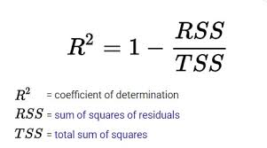

# Linear Regression

## 1. Important Terms
Assumptions, Linear, Multiple, Polinomial, Ridge (L2), Laso (L1), Elastic Net, Linearity, Normality, Homoscedasticity, Multicolinearity, Error Distribution, MSE, RMSE, R2.

## 2. Resources
- [Analytics Vidhya - Linear Regression](https://www.analyticsvidhya.com/blog/2021/05/all-you-need-to-know-about-your-first-machine-learning-model-linear-regression/, 'Linear Regression')
- [How to transform features into Normal/Gaussian Distribution](https://www.analyticsvidhya.com/blog/2021/05/how-to-transform-features-into-normal-gaussian-distribution/)

## 3. Quick Notes | Summary
- **Types of Linear Regression**
    - **`Simple Linear Regression`**  
    In simple linear regression, there is only one independent variable that is used to predict the dependent variable.

    - **`Multiple Linear Regression`**  
    Multiple linear regression extends simple linear regression to multiple independent variables. It models the relationship between the dependent variable and two or more independent variables. The equation of the model becomes a linear combination of the independent variables.

    - **`Polynomial Linear Regression (Non-Linear)`**  
    Polynomial regression is a form of regression analysis in which the relationship between the independent variable `x` and the dependent variable `y` is modeled as an `nth` degree polynomial. It allows for more flexible modeling of non-linear relationships.

    - **`Ridge Regression (L2 Regularization)`**  
    Ridge regression is a regularization technique used to prevent overfitting in linear regression models. It adds a penalty term to the standard linear regression objective function, which penalizes large coefficients. This helps to reduce model complexity and variance.

    - **`Lasso Regression (L1 Regularization)`**  
    Lasso regression is another regularization technique used in linear regression models. Similar to ridge regression, it adds a penalty term to the objective function. However, lasso regression uses the absolute values of the coefficients as the penalty term. This leads to sparsity in the coefficient values, effectively performing feature selection.

    - **`Elastic Net Regression`**  
    Elastic net regression combines the penalties of ridge and lasso regression. It adds both the `L1` and `L2` penalty terms to the objective function, allowing for a more flexible regularization approach.

- **Assumptions of Linear Regression**
    - **`Linearity`**  
    It states that the dependent variable Y should be linearly related to independent variables. This assumption can be checked by plotting a scatter plot between both variables.

    - **`Normality`**  
    The X and Y variables should be normally distributed. Histograms, KDE plots, Q-Q plots can be used to check the Normality assumption. 

    - **`Homoscedasticity`**  
    The variance of the error terms should be constant i.e the spread of residuals should be constant for all values of X. This assumption can be checked by plotting a residual plot. If the assumption is violated then the points will form a funnel shape otherwise they will be constant.

    - **`Independence/No Multicollinearity`**  
    The variables should be independent of each other i.e no correlation should be there between the independent variables. To check the assumption, we can use a correlation matrix or VIF score. If the VIF score is greater than 5 then the variables are highly correlated.

    - The **`error terms should be normally distributed`**. Q-Q plots and Histograms can be used to check the distribution of error terms.

 

- **How to deal with the `Violation of any of the Assumption` (See the resource section** - [**URL**](https://www.analyticsvidhya.com/blog/2021/05/how-to-transform-features-into-normal-gaussian-distribution/))

 

- **Evaluation Metrices for Regression Analysis**
    - **`R Squared or Coefficient of Determition`**  
      - **Simple R-Squared ( R2 )**  
        - R-squared measures the proportion of the variance in the dependent variable explained by the independent variables in the model.

        - It ranges from `0` to `1`, where 0 indicates that the model does not explain any variability, and one indicates that it explains all the variability.

        - Higher R-squared values suggest a better fit, but it doesn’t necessarily mean the model is a good predictor in an absolute sense.
        
        - `TSS` = Total Sum of Squares = Total variation in target variable is the sum of squares of the difference between the actual values and their mean.

        - `RSS` = Residual Sum of Squares = It the total square of the distance of actual points from the regression line. But if we focus on a single residual, we can say that it is the distance that is not captured by the regression line. **Therefore, RSS as a whole gives us the variation in the target variable that is not explained by our model**.

        - **Calculate R2** = Now, if `TSS` gives us the total variation in `Y`, and RSS gives us the variation in `Y` not explained by `X`, then `TSS-RSS` gives us the variation in `Y` that is explained by our model! We can simply divide this value by `TSS` to get the proportion of variation in `Y` that is explained by the model. And this our R-squared statistic!

        $$\begin{align*}
        R^2 & = \frac{TSS - RSS}{TSS} \\
            \\
            & = \frac{\text{Explained variation}}{\text{Total variation}} \\
            \\
            & = 1 - \frac{\text{Unexplained variation}}{\text{Total variation}}
        \end{align*}$$
  
        

      - **Adjusted R-Squared**  
        - It is the improvement to R squared. 
  
        - The problem/drawback with R2 is that as the features increase, the value of R2 also increases which gives the illusion of a good model. So the Adjusted R2 solves the drawback of R2. 
  
        - It only considers the features which are important for the model and shows the real improvement of the model.
  
        - Adjusted R2 is always lower than R2.  

        

      - **Comprison**  
        - R-squared will stay the same when adding more predictors, even if they are not contributing meaningfully. It may give a falsely optimistic view of the model.
    
        - Adjusted R-squared is more conservative and will decrease if additional variables do not contribute to the model’s explanatory power.
    
        - As a rule of thumb, a higher R-squared or Adjusted R-squared is desirable, but it’s crucial to consider the context of the specific analysis and the trade-off between model complexity and explanatory power

    -  **`Mean Squared Error (MSE)`**  
    Mean squared error which is the mean of the squared difference of actual vs predicted values.

    $$\text{MSE} = \frac{1}{n} \sum_{i=1}^{n} (y_i - \hat{y}_i)^2$$

    - **`Root Mean Squared Error (RMSE)`**  
    It is the root of MSE i.e Root of the mean difference of Actual and Predicted values. RMSE penalizes the large errors whereas MSE doesn’t.

    $$\text{RMSE} = \sqrt{\frac{1}{n} \sum_{i=1}^{n} (y_i - \hat{y}_i)^2}$$
