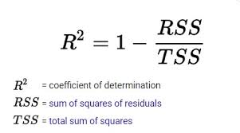
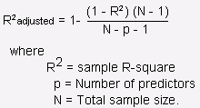

# Regression Metrices

## 1. Important Terms

## 2. Resources

## **Evaluation Metrices for Regression Analysis**
### 1. **`R Squared or Coefficient of Determition`**  
#### **Simple R-Squared ( R2 )**  
- R-squared measures the proportion of the variance in the dependent variable explained by the independent variables in the model.

- It ranges from `0` to `1`, where 0 indicates that the model does not explain any variability, and one indicates that it explains all the variability.

- Higher R-squared values suggest a better fit, but it doesn’t necessarily mean the model is a good predictor in an absolute sense.

- `TSS` = Total Sum of Squares = Total variation in target variable is the sum of squares of the difference between the actual values and their mean.

- `RSS` = Residual Sum of Squares = It the total square of the distance of actual points from the regression line. But if we focus on a single residual, we can say that it is the distance that is not captured by the regression line. **Therefore, RSS as a whole gives us the variation in the target variable that is not explained by our model**.

- **Calculate R2** = Now, if `TSS` gives us the total variation in `Y`, and RSS gives us the variation in `Y` not explained by `X`, then `TSS-RSS` gives us the variation in `Y` that is explained by our model! We can simply divide this value by `TSS` to get the proportion of variation in `Y` that is explained by the model. And this our R-squared statistic!

$$\begin{align*}
R^2 & = \frac{TSS - RSS}{TSS} \\
    \\
    & = \frac{\text{Explained variation}}{\text{Total variation}} \\
    \\
    & = 1 - \frac{\text{Unexplained variation}}{\text{Total variation}}
\end{align*}$$

#### **Adjusted R-Squared**  
- It is the improvement to R squared. 

- The problem/drawback with R2 is that as the features increase, the value of R2 also increases which gives the illusion of a good model. So the Adjusted R2 solves the drawback of R2. 

- It only considers the features which are important for the model and shows the real improvement of the model.

- Adjusted R2 is always lower than R2.  

#### **Comprison**  
- R-squared may increase when adding more predictors, even if they are not contributing meaningfully. This can lead to a falsely optimistic view of the model's performance, especially if the additional predictors introduce overfitting.

- Adjusted R-squared is more conservative and will decrease if additional variables do not contribute to the model’s explanatory power.

- As a rule of thumb, a higher R-squared or Adjusted R-squared is desirable, but it’s crucial to consider the context of the specific analysis and the trade-off between model complexity and explanatory power

## 2. **`Mean Squared Error (MSE)`**  
Mean squared error which is the mean of the squared difference of actual vs predicted values.

$$
\text{MSE} = \frac{1}{n} \sum_{i=1}^{n} (y_i - \hat{y}_i)^2
$$

## 3. **`Root Mean Squared Error (RMSE)`**  
It is the root of MSE i.e Root of the mean difference of Actual and Predicted values. RMSE penalizes the large errors whereas MSE doesn’t.

$$
\text{RMSE} = \sqrt{\frac{1}{n} \sum_{i=1}^{n} (y_i - \hat{y}_i)^2}
$$
