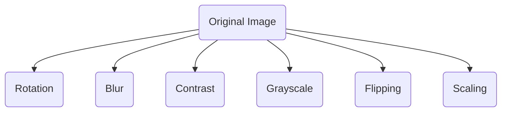
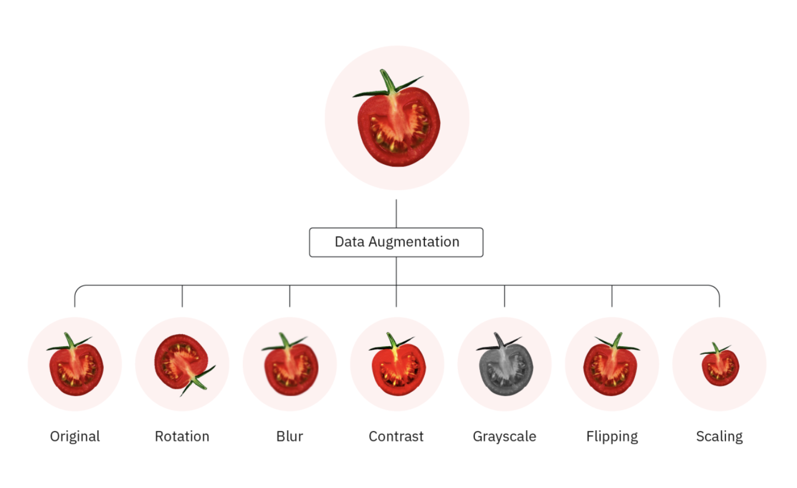
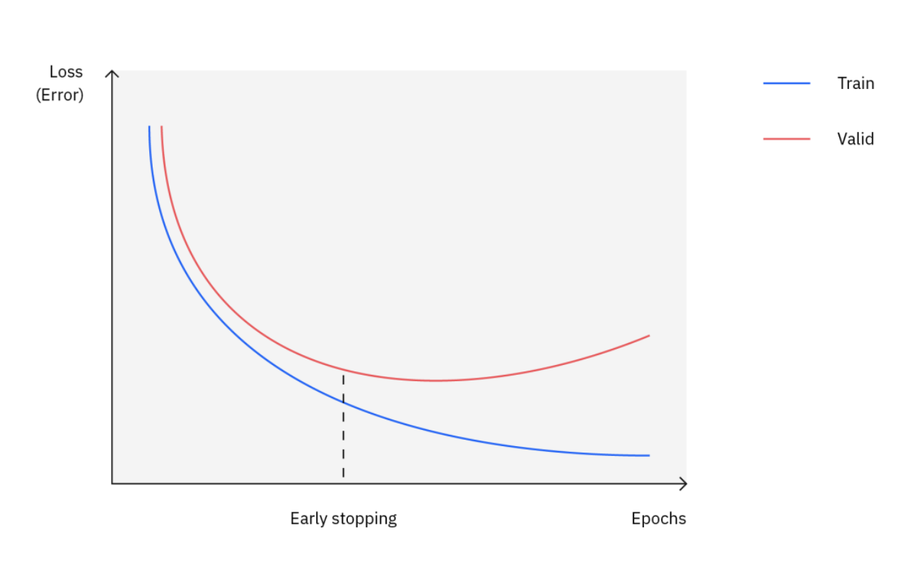

# Regularization

## Important Terms

## Resources

## Quick Notes | Summary
**`Regularization`** is a technique used in machine learning to **prevent overfitting and improve the generalization** of models. 

Overfitting occurs when a model learns the training data too well, capturing noise and irrelevant patterns in addition to the underlying structure of the data. 

Typically, regularization trades a marginal decrease in training accuracy for an increase in **`generalizability`**.  

### Why is Regularization Used?
1. **`Preventing Overfitting`**: The primary reason for using regularization is to prevent overfitting. By penalizing overly complex models, regularization helps ensure that the model captures the underlying patterns in the data rather than memorizing noise.
   
2. **`Improving Generalization`**: Regularization encourages models to generalize better to unseen data by promoting simpler models that are less likely to overfit the training data.

### When to Use Regularization?
1. The model's performance on the validation or test set is significantly worse than on the training set, indicating potential overfitting.

2. The dataset is relatively small, making it more susceptible to overfitting.

3. The model architecture is complex, increasing the risk of overfitting.

### Various methods of Regularization:
#### 1. L1 Regularization (Lasso Regression)
- L1 regularization, also known as Lasso regression.  
- **Penalty Term**: L1 regularization adds the ***sum of the absolute values of the model's coefficients*** to the loss function.    
- It encourages the model to reduce the coefficients of less important features to zero, effectively performing feature selection. 
- **λ (Lambda)**: This is a hyperparameter that controls the strength of the regularization. Higher λ leads to more shrinkage of coefficients.  
$$
\text{loss} = \text{original-loss-function} + \lambda * \text{sum}(|w|) 
$$
**`Merits`**
- It can be useful for feature selection as it tends to eliminate less important features.  
- L1 regularization is less sensitive to outliers in the data compared to L2 regularization.
  
**`Demerits`**
- While L1 performs feature selection, it might not always pick the most informative features, especially when features are highly correlated.

#### 2. L2 Regularization (Ridge Regression)
- L2 regularization, also known as Ridge regression.
- **Penalty Term**: L2 regularization adds the ***sum of the squares of the model's coefficients*** to the loss function.
- Encourages smaller coefficient values without necessarily pushing them to zero.  
- **λ (Lambda)**: Similar to L1, λ controls the strength of regularization.
$$
\text{loss} = \text{original-loss-function} + \lambda * \text{sum}(|w^2|) 
$$
**`Merits`**
- Like L1, L2 regularization reduces model complexity and improves generalization.
- **Computationally Efficient**: The squared term in L2 is easier to handle for optimization algorithms compared to the absolute value in L1.
- More Stable with Correlated Features: L2 performs better than L1 when features are highly correlated.: L2 performs better than L1 when features are highly correlated.
  
**`Demerits`**
- **Not Effective for Feature Selection**: L2 doesn't inherently perform feature selection as coefficients are shrunk but not set to zero.
- **Sensitive to Outliers**: The squared term in L2 can amplify the effect of outliers, potentially leading to poor performance.

#### **`NOTE`**
**Choosing Between L1 and L2**  
The optimal choice between L1 and L2 depends on your specific problem:  
- **Feature Selection Needed**: If interpretability and identifying important features are crucial, L1 is a good choice.
- **Outlier-Prone Data**: L1 might be more robust if your data has potential outliers.
- **Highly Correlated Features**: If features are correlated, L2 might be more stable.

**Additional Considerations**
- **Elastic Net Regularization**: Combines L1 and L2 penalties, offering a balance between sparsity and stability.
- **Cross-Validation**: Use techniques like cross-validation to tune the hyperparameter λ for both L1 and L2 to find the best model for your data.

#### 3. Elastic Net Regularization
Combines L1 and L2 regularization, allowing for a mixture of both penalties.
Offers a balance between feature selection (L1) and coefficient shrinkage (L2).
$$
\text{Loss} = (y, f(x)) + \lambda * (\alpha * || \beta||_1 + (1-\alpha) +\frac{1}{2} ||\beta||_2^2)
$$

Where:
- Loss: The original loss function you're trying to minimize (e.g., mean squared error for regression, logistic loss for classification).
- y: The target variable.
- f(x): The model's prediction for a given input x.
- λ: The tuning parameter that controls the overall strength of the regularization (higher λ means more regularization).
- α: The mixing parameter (0 ≤ α ≤ 1) that determines the relative weight between L1 and L2 penalties.
  - α = 0: Equivalent to pure L2 regularization (ridge regression).
  - α = 1: Equivalent to pure L1 regularization (lasso regression).
  - Values between 0 and 1 provide a balance between sparsity and stability.
- $||\beta||_1$: The L1 norm of the coefficient vector β, which is the sum of the absolute values of the coefficients (encourages sparsity).
- $||\beta||_2^2$: The squared L2 norm of the coefficient vector β, which is the sum of the squares of the coefficients (shrinks coefficients towards zero).

This formula essentially adds a penalty term to the original loss function. The penalty term discourages models with very large coefficients (L2) and encourages models with many coefficients set to zero (L1), depending on the value of α. By balancing these two components, elastic net aims to achieve both good generalization performance (avoiding overfitting) and interpretability (identifying important features through sparsity).

#### 4. Dropout Regularization
A technique specific to neural networks.
Randomly drops a proportion of neurons during training, effectively creating an ensemble of smaller networks. Helps prevent co-adaptation of neurons and reduces overfitting.  
**`Merits`**: Effective for large neural networks.  
**`Demerits`**: Can increase training time.

### Merits and Demerits of Regularization:
**`Merits`**
1. Prevents overfitting by penalizing complex models.
2. Improves generalization by encouraging simpler models.
3. Can be applied to various machine learning algorithms.
   
**`Demerits`**:
1. May require tuning of hyperparameters (e.g., regularization strength) which can be time-consuming.
2. In some cases, regularization can lead to underfitting if applied excessively.
3. Certain regularization techniques may not be suitable for all types of data or models.

#### 5. Data augmentation
It is a regularization technique that modifies model training data. It expands the size of the training set by creating artificial data samples derived from pre-existing training data. Adding more samples to the training set, particularly of instances rare in real world data, exposes a model to a greater quantity and diversity of data from which it learns.  

  

#### 5. Early Stopping
It is perhaps the most readily implemented regularization technique. In short, it limits the number of iterations during model training. Here, a model continuously passes through the training data, stopping once there is no improvement (and perhaps even deterioration) in training and validation accuracy. The goal is to train a model until it has reached the lowest possible training error preceding a plateau or increase in validation error.

