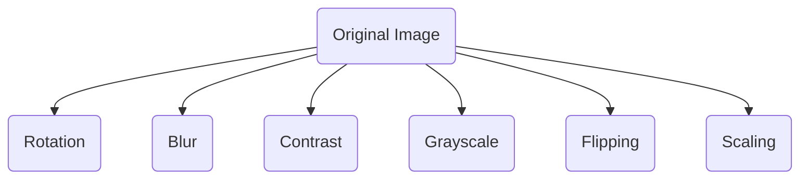

# Regularization

## Important Terms

## Resources

## Quick Notes | Summary
**`Regularization`** is a technique used in machine learning to **prevent overfitting and improve the generalization of models**. 

Overfitting occurs when a model learns the training data too well, capturing noise and irrelevant patterns in addition to the underlying structure of the data. 

Typically, regularization trades a marginal decrease in training accuracy for an increase in **`generalizability`**.  

### Why is Regularization Used?
1. **`Preventing Overfitting`**: The primary reason for using regularization is to prevent overfitting. By penalizing overly complex models, regularization helps ensure that the model captures the underlying patterns in the data rather than memorizing noise.
   
2. **`Improving Generalization`**: Regularization encourages models to generalize better to unseen data by promoting simpler models that are less likely to overfit the training data.

### When to Use Regularization?
1. The model's performance on the validation or test set is significantly worse than on the training set, indicating potential overfitting.

2. The dataset is relatively small, making it more susceptible to overfitting.

3. The model architecture is complex, increasing the risk of overfitting.

### Various methods of Regularization:
#### 1. L1 Regularization (Lasso)
L1 regularization, also known as Lasso regularization, penalizes the absolute values of the coefficients in a model. It encourages the model to reduce the coefficients of less important features to zero, effectively performing feature selection. 
**`Merits`**: Can be useful for feature selection as it tends to eliminate less important features.  
**`Demerits`**: May not work well if there are strong correlations between features.

#### 2. L2 Regularization (Ridge)
Adds a penalty term proportional to the square of the coefficients to the loss function.
Encourages smaller coefficient values without necessarily pushing them to zero.  
**`Merits`**: Works well when features are correlated.  
**`Demerits`**: Does not perform feature selection.

#### 3. Elastic Net Regularization
Combines L1 and L2 regularization, allowing for a mixture of both penalties.
Offers a balance between feature selection (L1) and coefficient shrinkage (L2).

#### 4. Dropout Regularization
A technique specific to neural networks.
Randomly drops a proportion of neurons during training, effectively creating an ensemble of smaller networks. Helps prevent co-adaptation of neurons and reduces overfitting.  
**`Merits`**: Effective for large neural networks.  
**`Demerits`**: Can increase training time.

### Merits and Demerits of Regularization:
**`Merits`**
1. Prevents overfitting by penalizing complex models.
2. Improves generalization by encouraging simpler models.
3. Can be applied to various machine learning algorithms.
   
**`Demerits`**:
1. May require tuning of hyperparameters (e.g., regularization strength) which can be time-consuming.
2. In some cases, regularization can lead to underfitting if applied excessively.
3. Certain regularization techniques may not be suitable for all types of data or models.

#### 5. Data augmentation
It is a regularization technique that modifies model training data. It expands the size of the training set by creating artificial data samples derived from pre-existing training data. Adding more samples to the training set, particularly of instances rare in real world data, exposes a model to a greater quantity and diversity of data from which it learns.  

  

#### 5. Early Stopping
It is perhaps the most readily implemented regularization technique. In short, it limits the number of iterations during model training. Here, a model continuously passes through the training data, stopping once there is no improvement (and perhaps even deterioration) in training and validation accuracy. The goal is to train a model until it has reached the lowest possible training error preceding a plateau or increase in validation error.

