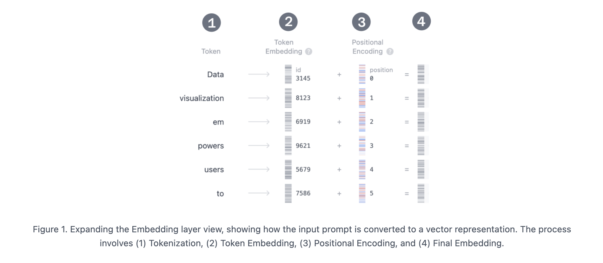

# Transformers

[Transformer Explainer](https://poloclub.github.io/transformer-explainer/)

## **Key Points to Remember about Transformers**  

- **Revolutionary AI Architecture** – Introduced in 2017 via the paper **"Attention is All You Need"**.  
- **Widely Used in AI** – Powers models like **GPT (OpenAI), Llama (Meta), Gemini (Google)**.  
- **Beyond Text** – Applied in **audio generation, image recognition, protein folding, game playing**, etc.  
- **Core Function** – Predicts the **next word** in a sequence based on prior text.  
- **Self-Attention Mechanism** – Captures **long-range dependencies** more effectively than previous models.  
- **Processes Entire Sequences** – Unlike older architectures like RNNs and LSTMs, it **analyzes all words simultaneously**.  

## **Key Components of Transformer Architecture**  

### **1. Embedding Layer** (Input Representation)  
It transforms the text into a numerical representation that the model can work with.  
1. Tokenize the input. 
2. Obtain token embeddings
3. Add positional information
4. Add up token and position encodings to get the final embedding. 

### **2. Transformer Block**  
Transformer block is the core of the Transformer's processing, which comprises **multi-head self-attention** and **Multi-Layer Perceptron layer**.  

Most models consist of multiple such blocks that are stacked sequentially one after the other.  

The token representations evolve through layers, from the first block to the 12th one, allowing the model to build up an intricate understanding of each token. This layered approach leads to higher-order representations of the input.

- **1. Multi-Head Self-Attention**  
  The self-attention mechanism enables the model to focus on relevant parts of the input sequence, allowing it to capture complex relationships and dependencies within the data.  
  
  **Step 1: Query, Key, and Value Matrices**

    Word embeddings are linearly projected into **three** different representations:
  - **Query (Q)**: Represents what each token is searching for.
  - **Key (K)**: Represents how much attention each token should receive.
  - **Value (V)**: Holds the actual information to be passed along.

  **Step 2: Masked Self-Attention**  
    Masked self-attention allows the model to generate sequences by focusing on relevant parts of the input while preventing access to future tokens.

  **Step 3: Output**  
The model uses the masked self-attention scores and multiplies them with the Value matrix to get the final output of the self-attention mechanism.

- **2. MLP (Multilayer Perceptron) Layer**  
  MLP layer is added to project the self-attention representations into higher dimensions to enhance the model's representational capacity.  
  
- **3. Layer Normalization & Residual Connections**  
  Stabilize training and improve learning.  

### **3. Output Layer** (Prediction)  
- **Final Linear & Softmax Layers** convert embeddings into probabilities.  
- Helps the model **predict the next token** in a sequence.  

These three components together enable **text generation, understanding, and context-aware predictions**. 🚀  

## 1. Important Terms

## 2. Resources

## 3. Quick Notes | Summary
### What Is the Transformer Architecture?
A transformer is a type of neural network architecture capable of learning context and relationships from sequential data such as text. This makes it applicable to a wide range of natural language processing (NLP) tasks such as:

- Machine translation
- Classification tasks
- Question answering (QA)
- Text generation
- Text summarization
- Sentiment analysis
- Conversational agents, i.e., chatbots
- Semantic search 

Although there are many variations of the transformer architecture, one of the most common ways to classify transformers is as encoder-decoder, encoder-only, and decoder-only. 

**1. Encoder-Decoder Transformers**  
Also called sequence-to-sequence transformers, they encode an input sequence and decode it into an output sequence. The best examples of encoder-decoder transformers are the original transformer model and the Text-to-Text Transfer Transformer (T5) model. 

**2. Encoder-Only Transformers**  
These models only encode input and do not undertake decoding. The best examples of encoder-only transformers are Bidirectional Encoder Representations from Transformers (BERT), also developed by Google, as well as its many variations like RoBERTa. 

**3. Decoder-Only Transformers**  
In contrast to encoder-only models, decoder-only transformers specialize in decoding input into output. Prolific examples of decoder-only transformers are the Generative Pre-trained Transformer (GPT) family of models by OpenAI, e.g., ChatGPT.

### Shortcomings of Previous Neural Network Architectures
To better appreciate the capabilities of the transformer architecture, let us now take a look at two of its prominent predecessors, recurrent neural networks (RNNs) and long short-term memory (LSTM). 

**Recurrent Neural Networks (RNNs)**  
An RNN processes input sequences a token at a time in cyclic iterations. The network’s input layer receives the first token of the input, which is then passed to hidden internal layers that process and output it for the next iterative step. This output, along with the next token from the sequence, is fed back into the neural network – so the output at every step is dependent on previous outputs as well as the current input. This process is repeated for every token in the input prompt. 

Additionally, the RNN maintains a hidden state – in the form of a vector that stores the context and dependencies between the tokens it has learned so far – effectively acting as the network’s memory.

**Long Short-Term Memory (LSTM)**  
An LSTM is a type of RNN that improves upon the conventional memory mechanism through cell states. These allow an LTSM to selectively recall or forget particular aspects of previous input according to their importance.

A cell contains three gates that store a value between 0 and 1, signifying the extent to what should be “let through” the gate and passed on to the next cell:
 
- **Forget gate**: indicates what current state information can be forgotten
- **Input gate**: what new information should be added to the state  
- **Output gate**: what information stored in the current state should be output  
  
Each cell takes a token, the previous cell state, and the output of the previous cell’s output to generate a new cell state, and an output.

**Both RNNs and LTSMs have two main drawbacks:**  
- **They process input sequentially:** each step in the process depends on the previous ones, resulting in longer training and inference times. Plus, this does not make efficient use of GPUs – which are designed for parallel computation.  
- **Inability to handle long-term dependencies:** this is where the network becomes less effective at keeping track of data points that are far apart in an input sequence; generally, the longer the input sequence, the higher the chance that contextual information is lost.

In contrast, the transformer’s self-attention mechanism allows it to process input sequences simultaneously in parallel, resulting in faster training and inference. Consequently, the transformer architecture makes efficient use of a GPU’s processing abilities and is more scalable than its predecessors – because you can add more GPUs to increase computational power. 

Secondly, the positional encoding mechanism within the transformer tracks the position of each token – eliminating the need for recurrence or hidden state vectors. This makes it easier for the network to handle longer-range dependencies, which allows for larger context windows. 

## Components of the Transformer Architecture
1. **Embedding Layer**  
This is where input enters the transformer, which breaks it down into tokens and turns them into numerical representations called embeddings that the model is better able to understand and process.

2. **Positional Encoder**  
This adds information to each token’s embedding to indicate its position within the sequence – without recurrence or maintaining an internal state. This is typically achieved by using an alternating set of sine and cosine functions to generate a unique positional signal for each token. Sine and cosine functions are well-suited to this purpose because they repeat their patterns over a regular interval, which is ideal for capturing sequential relationships, while being perpendicular to each other – preventing overlap.  

3. **Self-Attention Mechanism**  
The transformer’s self-attention component systematically compares token embeddings against each other to determine their similarity and relevance. This results in a weighted representation of the input which captures the appropriate patterns and relationships between the tokens, which the transformer can use to calculate the most probable output.    
Both the encoder and decoder feature self-attention mechanisms, with the encoder containing a single self-attention layer and the decoder containing two such layers. 

4. **Encoder**  
The encoder’s purpose is to take the input sequence and convert, or encode, it into a weighted embedding that the decoder can use to generate output.   
As opposed to a single encoder, transformers contain several encoders in a stack – with the original transformer featuring a stack of six encoders, for example. This increases the transformer’s efficacy, as each encoding layer captures different aspects of the input to enhance its understanding and, subsequently, the model’s predictive capabilities. 

5. **Decoder**  
The decoder takes the weighted embedding output by the encoder, generates the most probable output tokens, and decodes them into readable output.   
Like the encoder, the transformer architecture contains a stack of decoders – mirroring the number of encoders, e.g., six in the original design.

